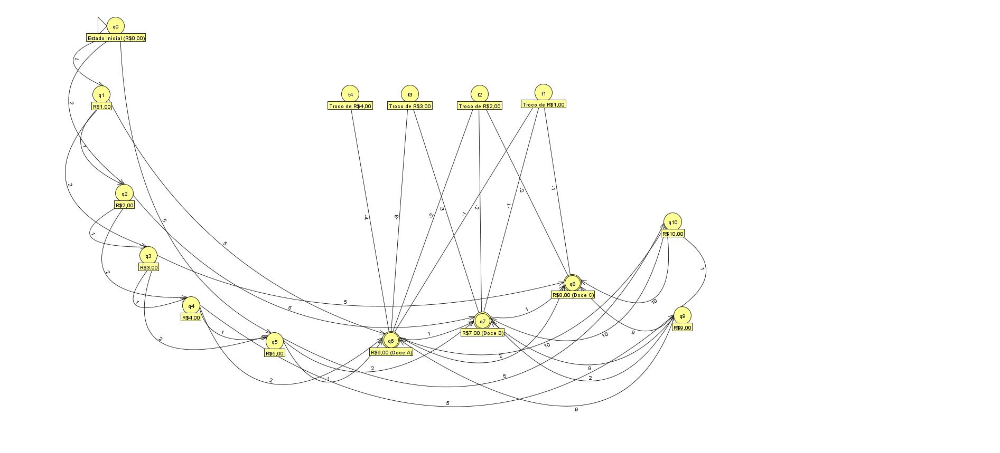

# React Vending Machine

## Sobre o projeto
Este repositório contém a aplicação front-end para o Primeiro Case da A3 da UC de Teoria da Computação e Compiladores.
Neste projeto, se construiu um pequenino sistema front-end que simula a lógica computacional de uma máquina de doces, que recebe cédulas monetárias, gerencia a sua quantidade em tempo real através de gerenciamento de estado e que possui desdobramentos lógicos com base nas decisões do usuário no uso da mesma.

Nisto, simula-se o comportamento de um autômato, que observa em tempo real a síntaxe das linhas de código inputadas em um arquivo, e que reconhece se as mesmas são ou não pertencentes à linguagem com que se está sendo trabalhada.

Deste modo, o autômato dá-se ao trabalho de permitir que somente se compile aquilo que componha a linguagem e de impedir que instruções erradas sejam compiladas na execução das instruções.

## Estrutura Lógica

A figura abaixo representa o esquema lógico do autômato desta máquina de doces, contendo os casos para as possíveis ações inputadas nesse sistema: 

Tais ações incluem:
- A recepção das cédulas de R$1.00, R$2.00 e R$5.00;
- O valor do crédito sendo acrescido conforme a adição das cédulas;
- A dedução do crédito mediante a compra de algum dos três produtos;
- A devolução do troco (se houver) do cliente através da dedução do preço do produto do valor total em crédito;
- As operações de resultado negativo, isto é, que tragam como consequência uma resposta negativa do sistema, de incapacidade de obtenção do produto.

## Mockup da aplicação front-end

O desenho abaixo representa a estrutura aproximada da aparência do front-end:

## Membros do Projeto
- Davi Batista (823212282)
- Rômulo Mendes (822161394)
- Silas Rodrigues (82327338)
- Mateus Idibal (824218817)
- Gabriel Argoso (82413799)
- Caique Andrade (823121611)