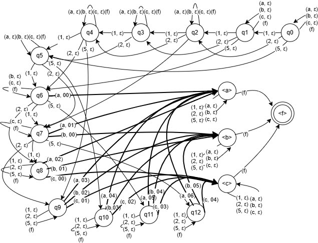
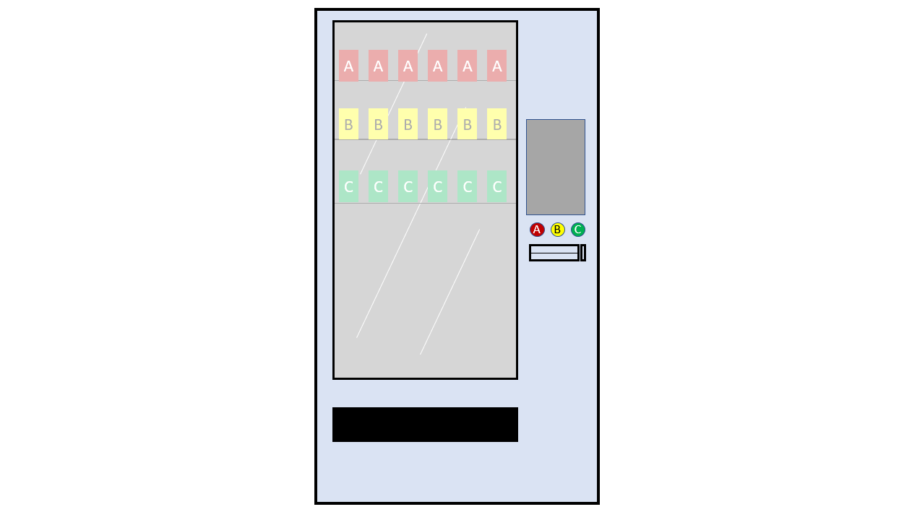
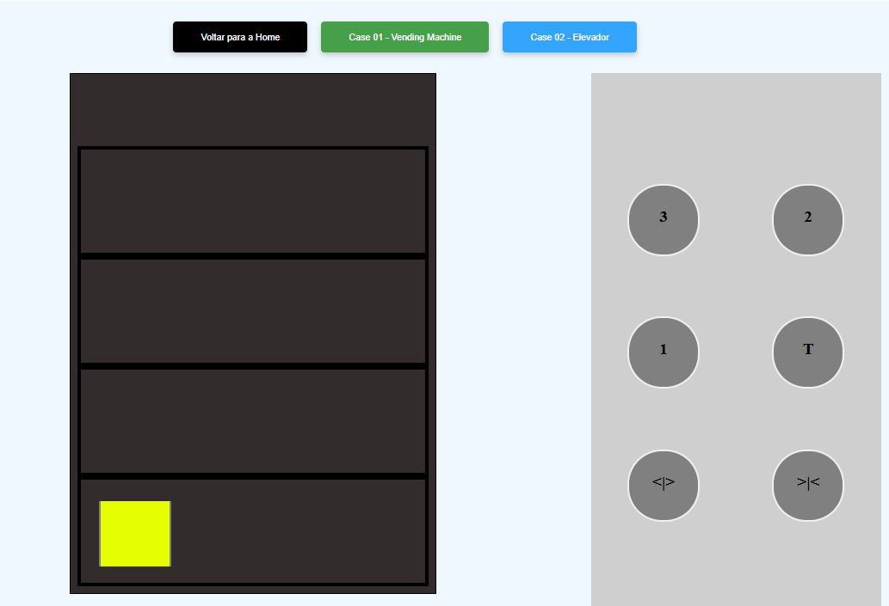

# 📖 Índice
- [Case 01 - Vending Machine](#vending-machine)
- [Case 02 - Elevador](#elevator)
- [Membros do Grupo](#members)

## Sobre

Este repositório contém um front-end contendo várias sub-aplicações desenvolvidas para diversos cases feitos durante o semestre da disciplina de Teoria da Computação e Compiladores, de modo a representar sistemicamente o funcionamento de autômatos e outros conceitos de computação em baixo nível.

## Case 01: React Vending Machine 

Neste projeto, se construiu um pequenino sistema front-end que simula a lógica computacional de uma máquina de doces, que recebe cédulas monetárias, gerencia a sua quantidade em tempo real através de gerenciamento de estado e que possui desdobramentos lógicos com base nas decisões do usuário no uso da mesma.

Nisto, simula-se o comportamento de um autômato, que observa em tempo real a síntaxe das linhas de código inputadas em um arquivo, e que reconhece se as mesmas são ou não pertencentes à linguagem com que se está sendo trabalhada.

Deste modo, o autômato dá-se ao trabalho de permitir que somente se compile aquilo que componha a linguagem e de impedir que instruções erradas sejam compiladas na execução das instruções.

### Estrutura Lógica do Case 01

A figura abaixo representa o esquema lógico do autômato da máquina de doces, contendo os casos para as possíveis ações inputadas nesse sistema: 

Tais ações incluem:
- A recepção das cédulas de R$1.00, R$2.00 e R$5.00;
- O valor do crédito sendo acrescido conforme a adição das cédulas;
- A dedução do crédito mediante a compra de algum dos três produtos;
- A devolução do troco (se houver) do cliente através da dedução do preço do produto do valor total em crédito;
- As operações de resultado negativo, isto é, que tragam como consequência uma resposta negativa do sistema, de incapacidade de obtenção do produto.

### Mockup da aplicação front-end

O desenho abaixo representa a estrutura aproximada da aparência do front-end:

## Case 02: Elevador 

Neste projeto, construiu-se um pequeno sistema para simular o funcionamento de um elevador em quatro andares, sendo um deles o térreo. Nesse sistema, há a necessidade do uso de memória para a guarda do estado atual e passado. Durante o percurso, o elevador poderá estar em diversos andares, tendo sempre que passar por um para chegar até o outro, e suas portas poderão estar sob os estados "ABERTAS" e "FECHADAS". O elevador somente é capaz de se movimentar com suas portas estando fechadas, de modo que é obrigatório que o sistema possua uma trava de segurança em suas tratativas para impedir que o elevador possa transitar de andar com elas abertas.

### Estrutura Lógica do Case 02

A figura a seguir mostra a estrutura lógica do autômato utilizado como base para este case. Suas operações contemplam os estados em cada um dos andares, e as operações extras como a abertura e o fechamento das portas do elevador.

## Membros do Projeto 
- [Davi Batista (RA: 823212382)](https://github.com/odavibatista)
- [Rômulo Mendes (822161394)](https://github.com/Romulomrs)
- [Silas Rodrigues (82327338)](https://github.com/SilasNR)
- Mateus Idibal (824218817)
- Gabriel Argoso (82413799)
- Caique Andrade (823121611)